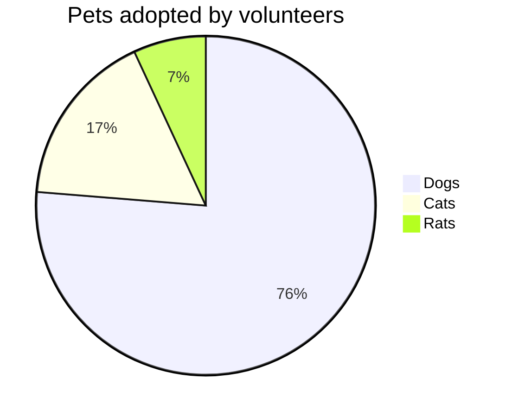
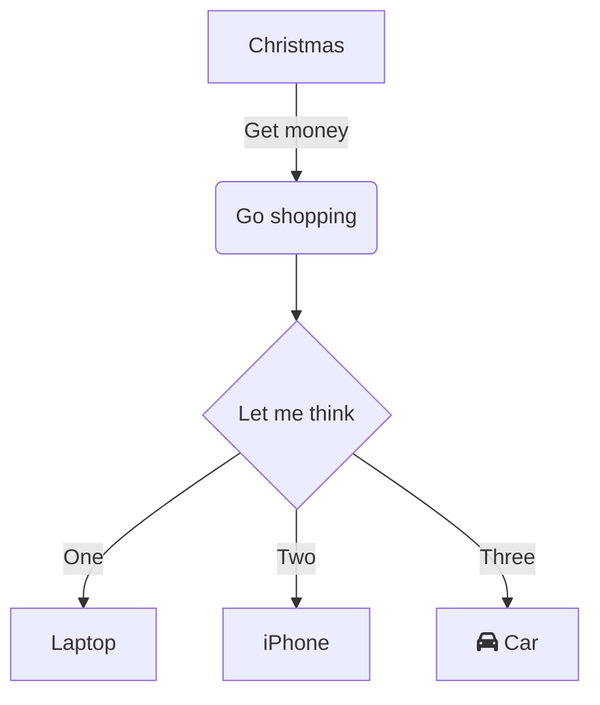
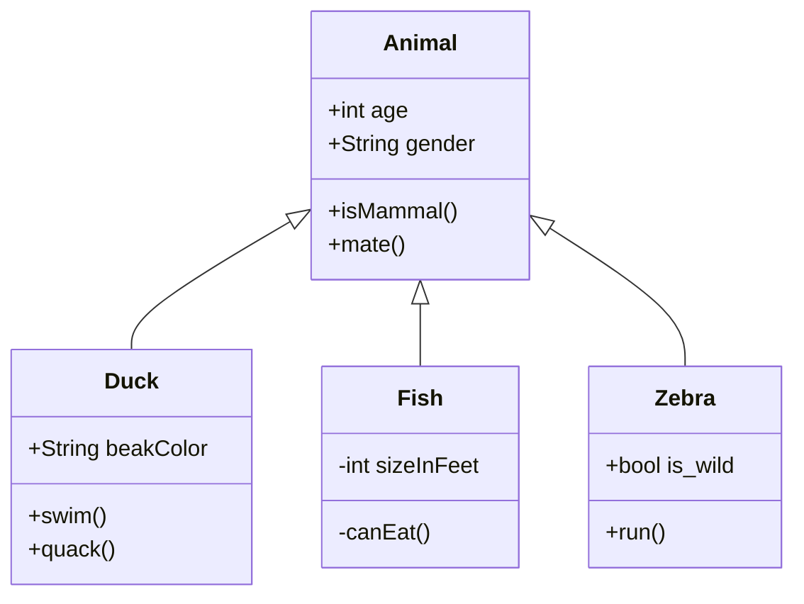
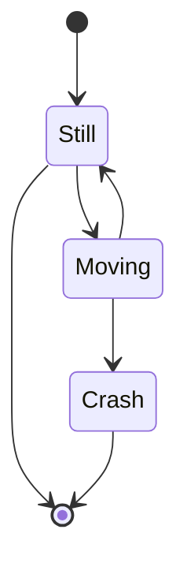

## 제목
`<h1>`, `<h2>`, `<h3>`, `<h4>`, `<h5>`, `<h6>` 태그로 변환되는 '제목(Header)'을 표현합니다.
```markdown
# 제목 1 
## 제목 2 
### 제목 3 
#### 제목 4 
##### 제목 5 
###### 제목 6
```

`<h1>`, `<h2>`는 다음과 같이 표현할 수도 있습니다.
```markdown
제목 1 
====== 
제목 2 
------
```
## 강조
각각 `<em>`(기울임), `<strong>`(두꺼움), `<del>`(취소선) 태그로 변환되는 '강조(Emphasis)'를 표현합니다.  
마크다운에서 지원하지 않는 밑줄을 추가하려면, `<u></u>`(밑줄) 태그를 직접 사용할 수 있습니다.
```markdown
이텔릭체는 *별 기호(Asterisks)* 혹은 _언더바 기호(Underscore)_ 를 사용하세요. 

두껍게는 **별 기호(asterisks)** 혹은 __언더바 기호(underscore)__ 를 2번씩 사용하세요. 

__*이텔릭체*와 두껍게__ 를 혼용할 수도 있습니다. 

취소선은 ~~물결 기호(tilde)~~ 를 사용하세요.

<u>밑줄</u>은 마크다운에서 지원하지 않기에, 직접 `<u></u>` 태그를 사용하세요.
```

**출력 결과:**

이텔릭체는 _별 기호(Asterisks)_ 혹은 _언더바 기호(Underscore)_ 를 사용하세요. 
두껍게는 **별 기호(asterisks)** 혹은 **언더바 기호(underscore)** 를 2번씩 사용하세요.  
**_이텔릭체_와 두껍게** 를 혼용할 수도 있습니다.

취소선은 ~~물결 기호(tilde)~~ 를 사용하세요.  
밑줄은 마크다운에서 지원하지 않기에, 직접 `<u></u>` 태그를 사용하세요.
## 목록
`<ol>`, `<ul>`, `<li>` 태그로 변환되는 '목록(List)'을 표현합니다.  
`1.` 로 시작하는 항목을 작성하면 `<ol>`로 변환되며, `-`로 시작하는 항목을 작성하면 `<ul>`로 변환됩니다.  
들여쓰기를 통해 하위 목록을 작성할 수 있습니다.
```markdown
`-`로 시작하는 순서가 없는 목록으로 구분합니다. 

1. 순서가 있는 항목 
1. 순서가 있는 항목 
	1. 순서가 없는 항목 
	2. 순서가 없는 항목 
2. 순서가 있는 항목 
3. 순서가 있는 항목 

- 순서가 없는 항목 
- 순서가 없는 항목 
	- 순서가 없는 항목 
	- 순서가 없는 항목
```

**출력 결과:**
1. 순서가 있는 항목
2. 순서가 있는 항목
    1. 순서가 없는 항목
    2. 순서가 없는 항목
3. 순서가 있는 항목
4. 순서가 있는 항목

- 순서가 없는 항목
- 순서가 없는 항목
    - 순서가 없는 항목
    - 순서가 없는 항목
## 링크
`<a>`로 변환되는 '링크(Links)'를 표현합니다.
```markdown
[이름](링크) 
[이름](링크 "설명") 
[이름][참조] 

[참조]: 링크 
[참조]: 링크 "설명"
```

```markdown
[GOOGLE](https://google.com) 
[NAVER](https://naver.com "링크 설명(title)을 작성하세요.") 
[상대적 참조](../users/login) 
[Dribbble][Dribbble Link] 
[GitHub][1] 

문서 안에서 [참조 링크]를 그대로 사용할 수도 있습니다. 다음과 같이 문서 내 일반 URL이나 꺾쇠 괄호(`< >`, Angle Brackets)안의 URL은 자동으로 링크를 사용합니다. 

구글 홈페이지: https://google.com 
네이버 홈페이지: <https://naver.com> 

[Dribbble Link]: https://dribbble.com 
[1]: https://github.com 
[참조 링크]: https://naver.com "네이버로 이동합니다!"
```

**출력 결과:**

[GOOGLE](https://google.com/)  
[NAVER](https://naver.com/ "링크 설명(title)을 작성하세요.")  
[상대적 참조](https://www.heropy.dev/users/login)  
[Dribbble](https://dribbble.com/)  
[GitHub](https://github.com/)

문서 안에서 [참조 링크](https://naver.com/ "네이버로 이동합니다!")를 그대로 사용할 수도 있습니다.  
다음과 같이 문서 내 일반 URL이나 꺾쇠 괄호(`< >`, Angle Brackets)안의 URL은 자동으로 링크를 사용합니다.

구글 홈페이지: [https://google.com](https://google.com/)  
네이버 홈페이지: [https://naver.com](https://naver.com/)
## 이미지
``로 변환되는 '이미지(Images)'를 표현합니다.  
링크과 비슷하지만, 앞에 `!`를 추가해야 합니다.
```markdown
 
 
![대체텍스트][참조] 

[참조]: 이미지주소 
[참조]: 이미지주소 "설명"

[](https://heropy.dev/)
```

## 코드 강조
`<pre>`, `<code>` 태그로 변환되는 '코드(Code)'를 표현합니다.  
`` ` `` (백틱) 기호를 사용합니다.

## 인라인
```markdown
`background` 혹은 `background-image` 속성으로 요소에 배경 이미지를 삽입할 수 있습니다.
```

**출력 결과:**

`background` 혹은 `background-image` 속성으로 요소에 배경 이미지를 삽입할 수 있습니다.

## 블록
`` ` ``를 3번 이상 입력하고 언어(코드) 이름을 명시해, 코드 '블록(Block)'를 표현합니다.  
코드 블록의 시작 `` ` `` 개수와 종료 `` ` `` 개수는 같아야 합니다.
```markdown
// 연속 백틱 3개 시작, 종료 구조 
```언어이름 
내용 
\``` 

// 연속 백틱 4개 시작, 종료 구조 
````언어이름 
내용 
\````
```

## 백틱 기호 사용
마크다운에서 백틱(`` ` ``) 기호는 코드 강조를 표현할 때 사용하는 문법 기능을 가지므로, 백틱 기호 자체를 출력하려면 기호에 이스케이프(Escape) 처리가 필요합니다.

다음과 같이 `\` 기호와 함께 작성하면, 백틱 기호를 출력할 수 있습니다.  
또는 `` ` ``에서 인라인 코드 강조를 하기 위해, `<code>` 태그를 활용할 수도 있습니다.
```markdown
\` 
<code>\`</code>
```

**출력 결과:**

\`
`` ` ``

## 표
`<table>` 태그로 변환되는 '표(Table)'를 표현합니다.  
테이블 헤더를 구분하기 위해, 3개 이상의 `-`(hyphen/dash) 기호를 사용합니다.  
테이블 헤더를 구분하며 `:`(Colons) 기호를 추가해 셀(열/칸) 안에 내용을 정렬할 수 있습니다.

- `---`, `:---`: 좌측 정렬
- `:---:`: 가운데 정렬
- `---:`: 우측 정렬

가장 좌측과 가장 우측에 있는 `|`(vertical bar) 기호는 생략 가능합니다. (플랫폼에 따라 생략 불가한 경우도 있습니다)
```markdown
| 헤더 | 헤더 | 헤더 | 
|---|---|---| 
| 셀 | 셀 | 셀 | 
| 셀 | 셀 | 셀 | 

헤더 | 헤더 | 헤더 
---|---|--- 
셀 | 셀 | 셀 
셀 | 셀 | 셀
```

```markdown
| 값 | 의미 | 기본값 | 
|---|:---:|---:| 
| `static` | 유형(기준) 없음 / 배치 불가능 | `static` | 
| `relative` | 요소 자신을 기준으로 배치 | | 
| `absolute` | 위치 상 부모(조상)요소를 기준으로 배치 | | 
| `fixed` | 브라우저 창을 기준으로 배치 | | 
| `sticky` | 스크롤 영역 기준으로 배치 | 
```
**출력 결과:**

| 값          |           의미           |      기본값 |
| ---------- | :--------------------: | -------: |
| `static`   |   유형(기준) 없음 / 배치 불가능   | `static` |
| `relative` |     요소 자신을 기준으로 배치     |          |
| `absolute` | 위치 상 부모(조상)요소를 기준으로 배치 |          |
| `fixed`    |    브라우저 창을 기준으로 배치     |          |
| `sticky`   |     스크롤 영역 기준으로 배치     |          |

## 인용문
`<blockquote>` 태그로 변환되는 '인용문(BlockQuote)'을 표현합니다.

```markdown
> 인용문 - 남의 말이나 글에서 직접 또는 간접으로 따온 문장. 
> _(네이버 국어 사전)_ 

BREAK! 

> 인용문을 작성하세요! 
>> 중첩된 인용문(nested blockquote)을 만들 수 있습니다. 
>>> 중중첩 인용문 1 
>>> 중중첩 인용문 2 
>>> 중중첩 인용문 3
```

**출력 결과:**

> 인용문 - 남의 말이나 글에서 직접 또는 간접으로 따온 문장.  
> _(네이버 국어 사전)_

BREAK!

> 인용문을 작성하세요!
> 
> > 중첩된 인용문(nested blockquote)을 만들 수 있습니다.
> > 
> > > 중중첩 인용문 1  
> > > 중중첩 인용문 2  
> > > 중중첩 인용문 3

## 원시 HTML

마크다운 문법 대신, HTML을 직접 사용(Raw HTML)할 수 있습니다.  
앞서 살펴본 밑줄 추가와 같이, 마크다운 문법에서 지원하지 않는 기능을 사용할 때 유용합니다.

```markdown
마크다운에서 <u>밑줄</u>은 지원하지 않습니다. 

 태그를 사용해야 합니다."> 


```

마크다운에서 <u>밑줄</u>은 지원하지 않습니다.

## 수평선

`---`, `___`, `***` 각 기호를 3개 이상 입력해, `<hr>` 태그로 변환되는 '수평선(Horizontal Rule)'을 표현합니다.

```markdown
--- 

*** 

___
```

**출력 결과:**

---

## 줄바꿈

줄바꿈(Line Breaks)을 위해서는 문장 마지막에서 `<br>` 태그를 직접 입력하거나, 문장 마지막에서 띄어쓰기를 2번 이상 입력합니다.

```markdown
동해물과 백두산이 마르고 닳도록 
하느님이 보우하사 우리나라 만세 
무궁화 삼천리 화려 강산 <!--띄어쓰기 2번--> 
대한 사람 대한으로 길이 보전하세<br> 
끝!
```

**출력 결과:**

동해물과 백두산이 마르고 닳도록 하느님이 보우하사 우리나라 만세 무궁화 삼천리 화려 강산  
대한 사람 대한으로 길이 보전하세  
끝!

## 주석

`<!-- -->`, `[//]: #` 기호를 사용해, 주석(Comment)을 표현합니다.

```markdown
-- 시작 -- 

<!-- 안녕하세요. --> 
[//]: # (안녕하세요.) 
[//]: # "안녕하세요." 
[//]: # '안녕하세요.' 

-- 종료 --
```

**출력 결과:**

-- 시작 --
<!-- 안녕하세요. --> 
[//]: # (안녕하세요.) 
[//]: # "안녕하세요." 
[//]: # '안녕하세요.' 
-- 종료 --
## 콜아웃
```markdown
>[!CallOut]
>TEST
```

> [!CallOut]
>TEST

## Mermaid

### 1. Pie chart
```markdown
\`\`\`mermaid!
pie title Pets adopted by volunteers
  "Dogs" : 386
  "Cats" : 85
  "Rats" : 35
\`\`\`
```


### 2. sequence diagram
```markdown
\`\`\`mermaid!
graph TD
A[Christmas] -->|Get money| B(Go shopping)
  B --> C{Let me think}
  C -->|One| D[Laptop]
  C -->|Two| E[iPhone]
  C -->|Three| F[fa:fa-car Car]
\`\`\`
```


### 3. Class diagram
```markdown
\`\`\`mermaid!
classDiagram
Animal <|-- Duck
Animal <|-- Fish
Animal <|-- Zebra
Animal : +int age
Animal : +String gender
Animal: +isMammal()
Animal: +mate()
class Duck{
  +String beakColor
    +swim()
    +quack()
}
class Fish{
  -int sizeInFeet
    -canEat()
}
class Zebra{
  +bool is_wild
    +run()
}
\`\`\`
```


### 4. State diagram
```markdown
\`\`\`mermaid!
stateDiagram
[*] --> Still
Still --> [*]

Still --> Moving
Moving --> Still
Moving --> Crash
Crash --> [*]
\`\`\`
```

